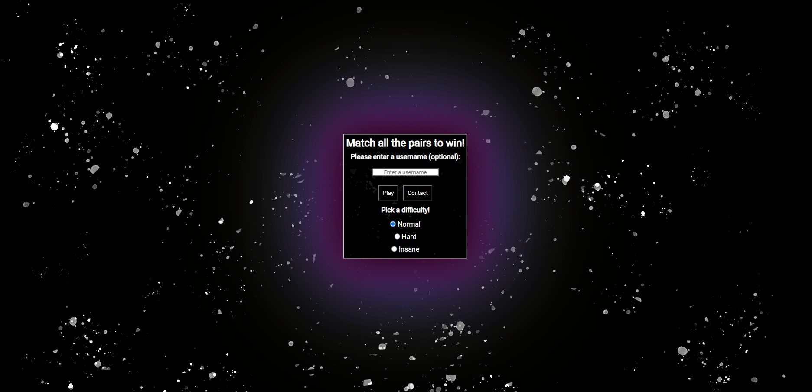

 
# Milestone Project 2 - Retro Space Themed Memory Game
# Table of Contents
* [Introduction](https://github.com/KNFullStack/Milestone-Project-2#introduction)
* [User Experience Design](https://github.com/KNFullStack/Milestone-Project-2#user-experience-design)  
  * [User Stories](https://github.com/KNFullStack/Milestone-Project-2#user-stories)
    * [First Time Visitors](https://github.com/KNFullStack/Milestone-Project-2#first-time-visitors)
    * [Returning Visitors](https://github.com/KNFullStack/Milestone-Project-2#returning-visitors)
    * [Frequent Users](https://github.com/KNFullStack/Milestone-Project-2#frequent-users)
  * [Structure](https://github.com/KNFullStack/Milestone-Project-2#structure)
  * [Design](https://github.com/KNFullStack/Milestone-Project-2#design)
    * [Colors](https://github.com/KNFullStack/Milestone-Project-2#colors)
    * [Typography](https://github.com/KNFullStack/Milestone-Project-2#typography)
    * [Images](https://github.com/KNFullStack/Milestone-Project-2#images)
    * [Sounds](https://github.com/KNFullStack/Milestone-Project-2#sounds)
    * [Wireframes](https://github.com/KNFullStack/Milestone-Project-2#wireframes)
    * [Design Deviations](https://github.com/KNFullStack/Milestone-Project-2#design-deviations)
  * [Limitations](https://github.com/KNFullStack/Milestone-Project-2#limitations)
* [Features](https://github.com/KNFullStack/Milestone-Project-2#features)
  * [Current Features](https://github.com/KNFullStack/Milestone-Project-2#current-features)
  * [Future Features](https://github.com/KNFullStack/Milestone-Project-2#future-features)
* [Technologies](https://github.com/KNFullStack/Milestone-Project-2#technologies)
  * [Languages](https://github.com/KNFullStack/Milestone-Project-2#languages)
  * [Libraries, Frameworks & Programs Used](https://github.com/KNFullStack/Milestone-Project-2#libraries-frameworks--programs-used)
* [Testing](https://github.com/KNFullStack/Milestone-Project-2#testing)
  * [Validation](https://github.com/KNFullStack/Milestone-Project-2#validation)
    * [HTML Validation](https://github.com/KNFullStack/Milestone-Project-2#html-validation)
    * [CSS Validation](https://github.com/KNFullStack/Milestone-Project-2#css-validation)
    * [JavaScript Validation](https://github.com/KNFullStack/Milestone-Project-2#javascript-validation)
  * [User Scenarios - Testing](https://github.com/KNFullStack/Milestone-Project-2#user-scenarios---testing)
    * [First Time User](https://github.com/KNFullStack/Milestone-Project-2#first-time-user)
    * [Returning User](https://github.com/KNFullStack/Milestone-Project-2#returning-user)
    * [Frequent User](https://github.com/KNFullStack/Milestone-Project-2#frequent-user)
  * [User Testing](https://github.com/KNFullStack/Milestone-Project-2#user-testing)
  * [Currently Known Bugs](https://github.com/KNFullStack/Milestone-Project-2#currently-known-bugs)
  * [Major Bugs Fixed During Development](https://github.com/KNFullStack/Milestone-Project-2#major-bugs-fixed-during-development)
  * [Lighthouse Results](https://github.com/KNFullStack/Milestone-Project-2#lighthouse-results)
* [Deployment](https://github.com/KNFullStack/Milestone-Project-2#deployment)
   * [Project Creation](https://github.com/KNFullStack/Milestone-Project-2#project-creation)
   * [Publishing](https://github.com/KNFullStack/Milestone-Project-2#publishing)
   * [Local Clone](https://github.com/KNFullStack/Milestone-Project-2#local-clone)
* [Acknowledgements](https://github.com/KNFullStack/Milestone-Project-2#acknowledgements)
  * [Code](https://github.com/KNFullStack/Milestone-Project-2#code)
  * [Media](https://github.com/KNFullStack/Milestone-Project-2#media)

You can find the published website here: [Retro Space Themed Memory Game!](xxxLINK TO PUBLISHED WEBSITE).
# Introduction

The project is part of a Full Stack Developer course run by CodeInstitute. This is Milestone Project 2. This project was to create a fun, interactive memory game for people to pass time with or challenge their friend's and family.

## Retro Space Themed Memory Game

A mockup of the game can be seen below:

# User Experience Design
## User Stories
### First Time Visitors
* What would I want to see as a first time visitor?
  1. Establish the theme upon first interactions.
  2. Easily find the button to play the game.
  3. Have feedback (visual or auditory) if a match is correct or incorrect.
  4. See my current score as I play the game.
### Returning Visitors
* What would I want to see as a returning visitor?
  1. Where to select different difficulties based, in order to test myself more.
  2. Is there a way I can contact the creator in order to submit bugs, errors or any other feedback?
### Frequent Users
* What would I want to see as a frequent visitor?
  1. A recent scoreboard feature so I could prove my score to someone I've challenged.
  2. Ability to enter a username so it can be put into the scoreboard.
  3. A way to contact the creator in order to suggest other kinds of games.
## Structure
Shown below are elements of the game that correspond to some of the User Stories:
* Big "Play" button in the middle of the first dialogue box.
> Easily find the button to play the game.
* Sounds are played when a correct or incorrect match is made and when the player wins.
> Have feedback (visual or auditory) if a match is correct or incorrect.
* A box containing the score is shown at the top of the game page.
> See my current score as I play the game.
* The background, website title and favicon initially show a space related element, with icons during the game being space related too.
> Establish the theme upon first interactions.
* Difficulties can be selected at the bottom of the first box when the page is loaded.
> Where to select different difficulties based, in order to test myself more.
* A "Contact" button is present on the first page that allows a user to submit feedback etc.
> Is there a way I can contact the creator in order to submit bugs, errors or any other feedback?

## Design
### Colors
The main colors for the game are black (rgb(0, 0, 0)), white (rgb(255, 255, 255)) and a deep pink (rgb(170, 19, 99)) for box auras. Aimed for an older/retro style design for the game.
### Typography
The text throughout the game uses the **Roboto** font.
### Images
The background image was created courtesy of my mentor, [Spencer Barriball](https://github.com/5pence). The image used in the favicon is thanks to [freepik](https://www.freepik.com/) (see link below in the "Acknowledgements" section for a direct link). 
### Sounds
The three sound clips that are used are from creators on [freesound](https://freesound.org/). See links to their profiles in the "Acknowledgements" section at the bottom of this README.
### Wireframes
Wireframes images can be seen below and also found in the "/assets/readme-content" folder. It contains a design for the desktop and mobile version of the game (images below show the game page Wireframes).

* Mobile:   
* Desktop:   

See link for PDF below:
* [Wireframe](assets/readme-content/Wireframe.pdf)

### Design Deviations
Compared to the original Wireframe there have been multiple deviations.
* The "Score:" box in the game page.
> Changes this to include 2 boxes, one showing the current score, and one showing the previous score of the game that was just played.
* The "Restart" and "Quit" button in the game page.
> Made these two button sit within the same container to give room for another button.
* The section above the game cards in the game page.
> Now contains a button to show recent scores too, which opens a pop up showing recent game wins (along with username, score and difficulty).
* The game page did nothing after a win apart from play a sound.
> The game page now displays a box after winning the game, which allows the user to go back to the main menu, restart the game, show the recent scores or just close the window.

Note: these changes were applied to both the desktop and mobile version of the game.

## Limitations
Currently there some limitations of the game.

* The recent scores section does not save when the browser is closed.
* There is no high scores feature showing the wins with the highest score.
* A user could use Dev Tools in order to find the pairs easier. 

# Features
## Current Features
* Auditory feedback when a user makes a correct or incorrect selection.
* Ability to change the difficulty of the game in order to make it more engaging for the user, especially if the "Normal" difficulty is too easy.
* Cards rearrange each time a new game is played.

## Future Features
Features that could be released in subsequent versions include:
* Saving the recent scores section.
* Having a high scores section that shows the wins with the highest score from previous sessions.
* Using custom icons for the cards.
* Altering the game logic so users cannot use Dev Tools to find the pairs easier.

# Technologies
Technologies used are as follows.
## Languages
* [HTML5](https://en.wikipedia.org/wiki/HTML5)
  * Used as the main language to code the game's content.
* [CSS3](https://en.wikipedia.org/wiki/CSS)
  * Used to incorporate custom styling into the game and its layout.
* [JavaScript](https://en.wikipedia.org/wiki/JavaScript)
  * Used to create the game logic and interactive elements of the game.

## Libraries, Frameworks & Programs Used
* [Balsamiq](https://balsamiq.com/)
   * Used to create the wireframes when starting the design.
* [Font Awesome](https://fontawesome.com/)
   * Used for multiple icons throughout the website.
* [Google Fonts](https://fonts.google.com/)
   * Used to incorporate the font "Roboto" by Christian Robertson.
* [Techsini](http://techsini.com/multi-mockup/index.php)
   * Used to generate the mockup image in this README file, see above.
* [GitHub](https://github.com/)
   * Used as a storage location for the website's content, including code and assets.
* [GitPod](https://www.gitpod.io/)
   * An online IDE used to write and test code that is written.
* [Git](https://git-scm.com/)
   * Used for version control to add, commit, and push files to GitHub.
* [Chrome Dev Tools](https://developer.chrome.com/docs/devtools/)
   * Used to test different CSS styles in the browser, inspect pages, general debugging, confirming JavaScript functionality with the Console and using Lighthouse.
* [favicon.cc](https://www.favicon.cc/)
    * Used to create the favicon.ico.
* [FreeConvert](https://www.freeconvert.com/video-compressor/)
    * Used to compress files.
* [W3C HTML Validator](https://validator.w3.org/)
    * Used to validate the HTML code.
* [W3C CSS Validator](https://jigsaw.w3.org/css-validator/)
    * Used to validate the CSS code.
* [JSHint](https://jshint.com/)
    * Used to validate the JavaScript code.

# Testing

The game has no backend functionality, therefore testing is based on the visual and interactive aspects of the game. High level testing includes:
* Running the game on 3 different browsers and simulating responsiveness on each, varying screen sizes will be simulated, ranging from a minimum width of 300px to a maximum width of 3000px:
  * Google Chrome
  * Mozilla Firefox
  * Opera
* No content in the containers, or the containers themselves overlapping other containers.
* Contact form to require an appropriate input in each field prior to submission.
* All buttons work as intended.
* Buttons display a working hover effect.
* Game is designed according to the wireframes made prior to coding.
* Interactive elements work as intended:
  * Icons hide and an "incorrect" sound is played if an incorrect pairing is made.
  * Icons stay and a "correct" sound is played if a correct pairing is made.
  * Difficulties work as intended.
  * Moving back down in difficulty results in that corresponding gameplay working (e.g. "Insane" to "Normal" removes the white background effect).
  * Windows open and close properly as intended throughout.
  * localStorage retains the user's username throughout the session, unless overwritten.
  * After winning a game, scores and "Recent Wins" table is correctly updated.

Test Results can be found here: [Test Results](assets/readme-content/test-result.xlsx)

## Validation
********************* ENSURE THIS IS COMPELTED PRIOR TO SUBMISSION ****************
********************* ENSURE THIS IS COMPELTED PRIOR TO SUBMISSION ****************
********************* ENSURE THIS IS COMPELTED PRIOR TO SUBMISSION ****************
********************* ENSURE THIS IS COMPELTED PRIOR TO SUBMISSION ****************
********************* ENSURE THIS IS COMPELTED PRIOR TO SUBMISSION ****************
********************* ENSURE THIS IS COMPELTED PRIOR TO SUBMISSION ****************
### HTML Validation
"index.html" was run through the [W3C HTML Validator](https://validator.w3.org/), via the direct input method.
* A warning was provided as two "script" elements were given an attribute of "type", this has been addressed.
* A warning was provided to note that a heading element is not present in the game page, this was acknowledged but left as is.
* An error was shown as per the following: "No p element in scope but a p end tag seen.". This was because a div element was nested within the p element, this has been addressed.
### CSS Validation
CSS Stylesheet was run through the [W3C CSS Validator](https://jigsaw.w3.org/css-validator/), via the direct input method. No issues were found.
### JavaScript Validation
JavaScript file was run through the [JSHint](https://jshint.com/).
XXX ANY ISSUES
XXX ANY ISSUES
XXX ANY ISSUES
XXX ANY ISSUES
XXX ANY ISSUES
XXX ANY ISSUES
## User Scenarios - Testing
How does the game design enable the goals of a first time, returning and frequent user? 
### First Time User
* Establish the theme upon first interactions.
  * Unable to be tested as this is down to user interpretation, however upon gameplay all icons are space related.
* Easily find the button to play the game.
  * Within the first box in the main menu a "Play" button is found. Button working as expected.
* Have feedback (visual or auditory) if a match is correct or incorrect.
  * Sound clips play correctly for each event.
* See my current score as I play the game.
  * Box in the top section of the gameplay screen highlighting the score, which correctly updates upon each correct or incorrect pairing. 
### Returning User
* Where to select different difficulties based, in order to test myself more.
  * Radio buttons found at the bottom of the main menu, displaying a normal, hard and insane mode. Each of these three difficulties work as intended and the correct difficulty restored when moving between difficulties.
* Is there a way I can contact the creator in order to submit bugs, errors or any other feedback?
  * Within the first box in the main menu a "Contact" button is found. Button opens a new box with a contact form that uses EmailJS. Messages correctly being sent to the determined Inbox with user feedback displaying. If an error occurs the user is also made aware of this.
### Frequent User
* A recent scoreboard feature so I could prove my score to someone I've challenged.
  * After each game win the gameplay details (Username, Score and Difficulty) are correctly appended into the dialogue box that opens when "Recent Wins" button is clicked. Up to 10 scores are permitted, the oldest score is removed and the newest score appended to the bottom of the table.
* Ability to enter a username so it can be put into the scoreboard.
  * Names entered into the username input box are correctly appended into the Recent Wins table. This username is remembered via localStorage and automatically entered into the username input box when the game is next loaded. When no username is entered the name "Anonymous" is used.
* A way to contact the creator in order to suggest other kinds of games.
  * Within the first box in the main menu a "Contact" button is found. Button opens a new box with a contact form that uses EmailJS. Messages correctly being sent to the determined Inbox with user feedback displaying. If an error occurs the user is also made aware of this.

## User Testing
A user kindly volunteered to play the game once overall development was complete. The user spent 15 minutes playing the game without any input from the developer, to try to determine if any gameplay issues or bugs arose.

User's comments were as follows:
* The ability to look at the "Recent Wins" table after a game win, instead of having to close the pop up and then access it.
  * This feature was then implemented.
* Noticed an error with the "Message" box on the contact form where the text color was white.
  * This was subsequently changed to black.
* Noticed that the username input had no limit, therefore entered an extremely long username. Once a game was then played and the username appended to the Recent Wins table, it was clear a limit needed to be implemented as the table became skewed.
  * A character limit was added via the HTML attribute "maxlength".

## Currently Known Bugs
1. If a user spam clicks different icons during the game, it has been noted that when a match is made during this spam clicking, one of the icons will not remain present - it will become hidden again and the card will become unclickable. This bug does not seem to be able to be repeated consistently and is therefore difficult to pinpoint why it is happening.
2. If a user rapidly makes two correct pairings after eachother, the "correct.wav" audio clip will not play as the first "correct.wav" instance has not yet finished.

## Major Bugs Fixed During Development
1. Selecting Insane game mode, then going back to Hard or Normal modes originally did not cause the Insane game mode elements to stop. A white background is placed over the cards in Insane mode once hovered, which was not removed when going back to Hard or Normal. This was fixed by giving the different game difficulties their own hover effect as needed.
2. Originally the game logic run via a function that was invoked when the user clicked on the "Play" button. This meant that at the end of a win, if the user returned to the main menu and clicked "Play" again, the game logic would be invoked again, causing it to run twice and so on. This meant that if a card was picked as an initial selection, it would count as two clicks as the function ran twice, therefore rendering the game inoperable once the "Play" button was clicked twice. This function was subsequently removed from a click listener event and added to the onload object.
3. Clicking on the cards technically meant the user was clicking on the icons as they were closer to the user in terms of z-index. The game logic is based on clicking the div elements that contain the icons. This was addressed thanks to some help from a user called "Friendly Crook" on [stackoverflow](https://stackoverflow.com/), where a CSS property called "pointer-events" was discovered (see link below in the "Acknowledgements" section for a direct link). 

## Lighthouse Results
Images below show the Lighthouse results on both mobile and desktop:
1. Mobile: 
1. Desktop: 

# Deployment
## Project Creation
To create the project, firstly a Chrome extension called "[Gitpod - Always ready to code](https://chrome.google.com/webstore/detail/gitpod-always-ready-to-co/dodmmooeoklaejobgleioelladacbeki?hl=en-GB)" was installed. A CodeInstitute template was use by navigating to the [GitHub Repo](https://github.com/Code-Institute-Org/gitpod-full-template) and clicking the "Use this template" button. The repository was named "Milestone-Project-2", the checkbox for "Include all branches" was checked and the green "Create repository from template" button was then clicked. From here, the green "GitPod" was then clicked (must use the above extension) and project folders and files created.

Common Git commands were used as follows:
* git add "filename-here" - used to stage files before commiting them.
* git add . - used to stage all files before commiting them.
* git commit -m "message here" - used to commit changes to the local repositry, with the message containing information on the changes that have occured.
* git status - used to check the tracking status of the file in the project.
* git push - used to push the changes to the GitHub repository.

## Publishing
To publish the project I performed the following steps:
1. Navigated to the project's [Github page](https://github.com/KNFullStack/Milestone-Project-2).
2. Clicked on the "Settings" button.
3. Clicked on the "Pages" button.
4. Under the "Source" heading, changed the "Branch" setting from "None" to "Main", then clicked save.
5. This gave a link to the [published game](XXXLINKTOPUBLISHEDWEBSITEXXX).
## Local Clone
To create a local clone of the project you can follow the steps below:
1. Navigate to the project's [Github page](https://github.com/KNFullStack/Milestone-Project-2).
2. Click the "Code" dropdown button.
3. From here there are two options:
     * Option 1: Click the "Download ZIP" button to download the files. This can be unzipped locally and opened with your preferred IDE.
     * Option 2: Copy the link from the HTTPS box shown. Then open your preferred IDE of choice and in the terminal window of your preferred directory, use the command "git clone" followed by the link that was copied. For example "git clone https://github.com/KNFullStack/Milestone-Project-2.git". This will clone the files in the selected directory.
# Acknowledgements
Would like to say thank you to my mentor Spencer Barriball for his help and guidance throughout the project.
## Code
* Thank you to [Friendly Crook](https://stackoverflow.com/users/4944031/friendly-crook), with his/her post regarding the "pointer-events" CSS property which allowed overcoming of an obstacle regarding click events. See [here](https://stackoverflow.com/questions/30508849/ignore-click-on-div) for the direct link.
* Thank you to [Florin Pop](https://www.florin-pop.com/) for the CSS code for the pulsing effect around the Username input box. See [here](https://www.florin-pop.com/blog/2019/03/css-pulse-effect/) for the direct link.
## Media
* Thank you to [flaticon](https://www.flaticon.com/premium-icon/space-rocket-launch_69906?term=space&page=1&position=5&page=1&position=5&related_id=69906&origin=tag) for the icon that was used to create the favicon.
* Thank you to multiple users on [freesound](https://freesound.org/) for the various sound clips that have been used.
  * User [unadamlar](https://freesound.org/people/unadamlar/) for the two sounds:
    * "correct.wav" -  direct link [here](https://freesound.org/people/unadamlar/sounds/476178/).
    * "wrong.wav" - direct link [here](https://freesound.org/people/unadamlar/sounds/476177/).
  * User [Tuudurt](https://freesound.org/people/Tuudurt/) for "winner.wav" - direct link [here](https://freesound.org/people/Tuudurt/sounds/275104/).